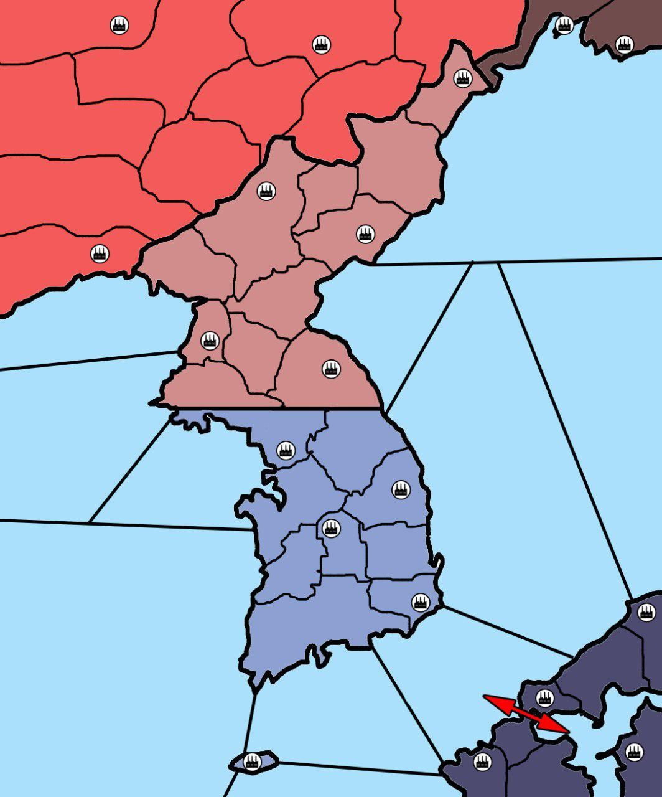

# Diplo bot
Telegram bot for managing countries in Military-Political Game ["Zeppelin: Belle Epoque"](https://t.me/ceppelinBE).

It watches under the playes actions like ruling armies, passing laws, making rebellions, assassinations, etc.

Gameplay is builded on the Rights and Classes system when each player belongs to some Class which is a set of Rights
allowing him to commit some game actions (like pass a law or rule armies).
On the other hand there are some illegal (or partly legal depends of laws of each country) actions
like assassination another player, rising up rebellion, etc. Every player represents a politic figure of some
period.

Right now __bot is in the test mode__.

### Test party
Now ongoing test party setting is a Korean War (1950-1953).  

__Countries:__
* 🇰🇵 Democratic People's Republic of Korea (North Korea);
* 🇰🇷 Republic of Korea (South Korea);
* ☭ Soviet Union;
* 🇨🇳 People Republic of China;
* 🇪🇺 UN Military Forces (US and Japanese forces, in game - NATO);

__[Rules](https://teletype.in/@diplomacy/r1QTDi-oN)__  
__[Bot Documentation](https://teletype.in/@diplomacy/H1Xj09biV)__
